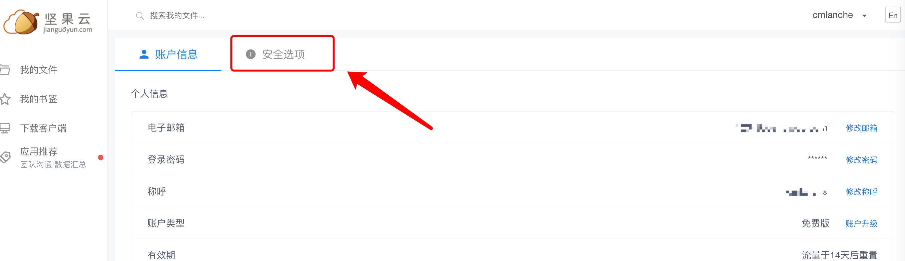

# 网盘功能使用说明

使用前提：先登录，并准备好webdav网盘（比如123网盘和坚果云）

其他说明：
- 其他支持webdav协议的网盘都可以
- 123网盘和坚果云最好用，坚果云免费就可以使用webdav，123网盘需要开通123网盘的会员才支持。
- 坚果云免费用户每个月最多100M的上传流量和3GB的下载流量，上传流量很有限，请节约上传
- 123云盘上传下载不限速，坚果云不清楚，目前测试感觉也不限速

## 添加云盘
左上角菜单，选择”添加云盘“

输入服务器地址、账户和密码

## 准备云盘
### 123网盘

#### 注册账户
可以通过[福利链接](https://www.123pan.com/s/cXByVv-cHpk.html)进入，注册账户

#### 获取webdav账户
登录123云盘后，点"第三方挂载"->"WebDav授权管理"，添加新应用，输入名称，会自动生成应用密码，如下图所示

### 坚果云
#### 注册账户
通过官网注册，地址：[https://www.jianguoyun.com/](https://www.jianguoyun.com/)

#### 获取webdav账户
登录坚果云后，右上角点个人账户菜单，选择”账户信息“，再选择”安全选项“，添加应用获取密码，如下图所示：

step1：

step2:

step3:

step4:

