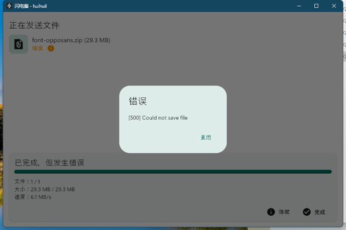
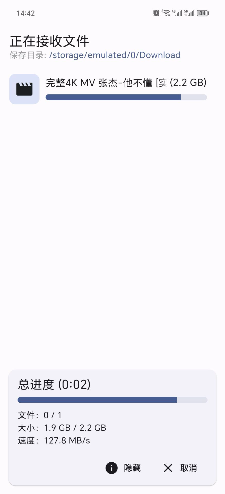
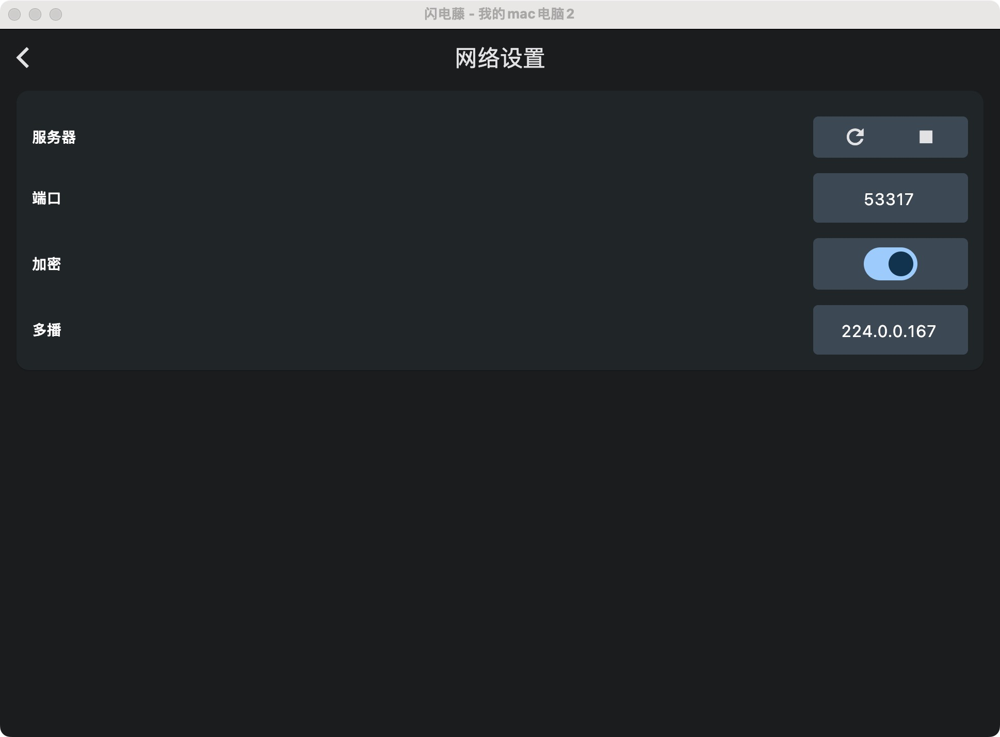
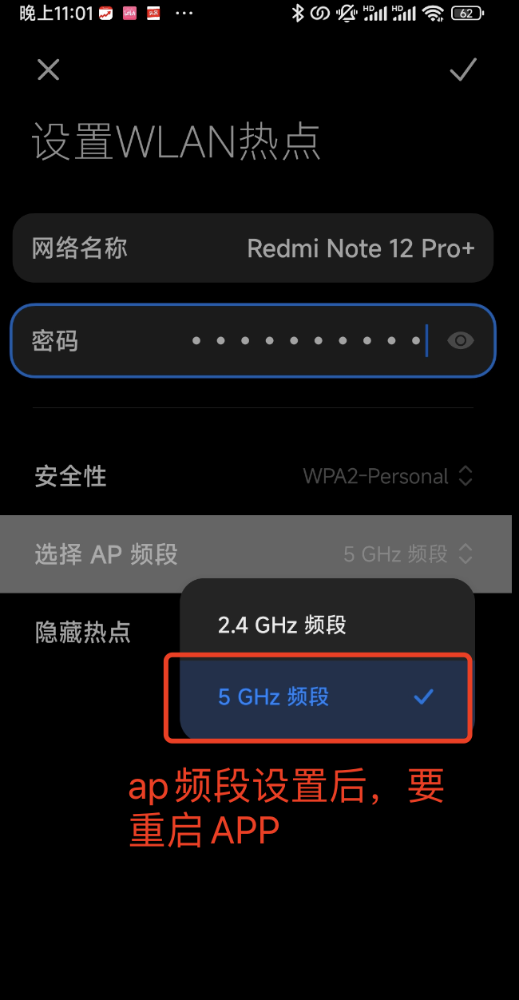
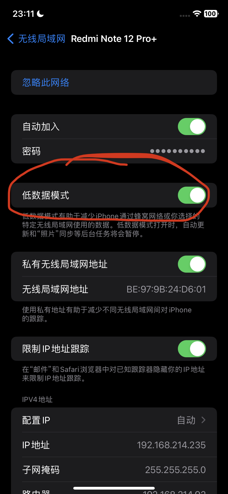
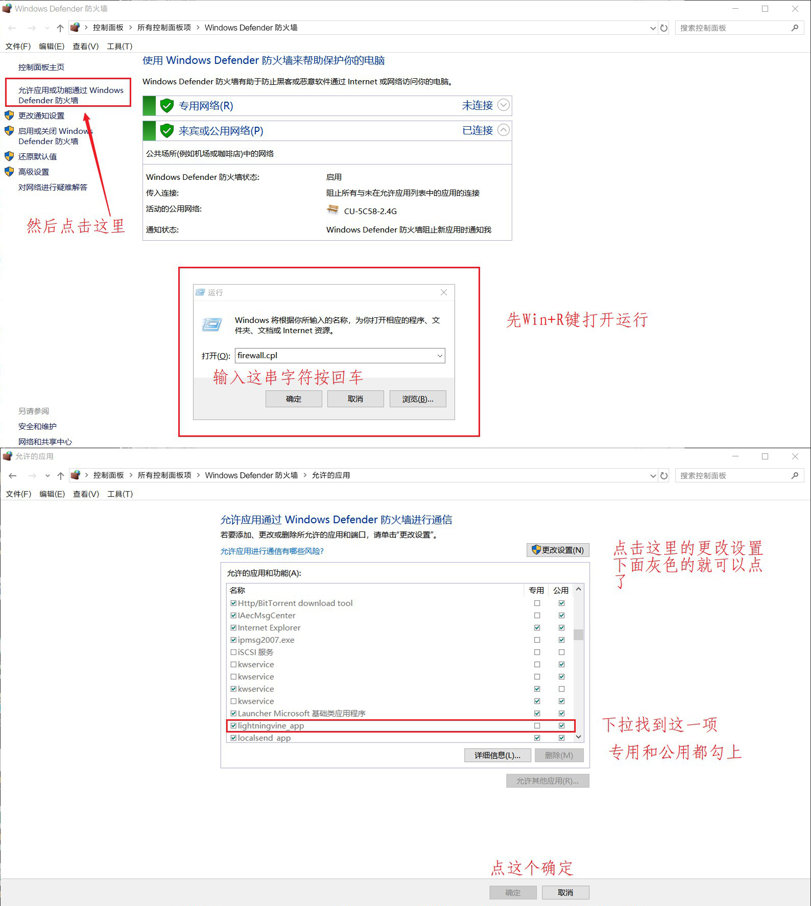
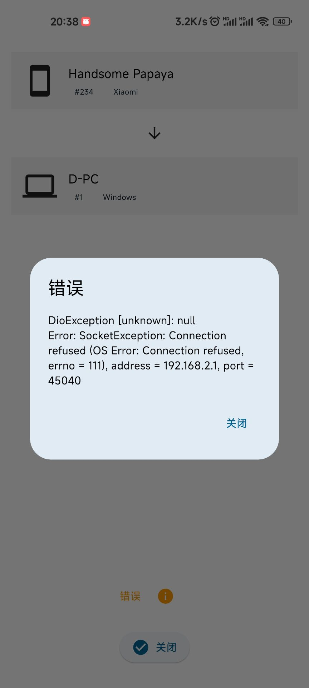

# 常见问题

## 部分win7电脑打开黑屏

如下图所示：

下载[这个文件](https://cdn.zishu.life/env/ms-net-framework4.8.exe)安装即可

## [500]Cound not save file

> 贡献者：huihuil，来自闪电藤官方QQ群（906458835）

无法保存文件，报500，类似一下图：

解决方案：请确认你的文件保存路径**是否存在并且有权限**，如果没有权限，请授予权限试试，如果已经有权限，可能因为目录不存在，则尝试更换到另外一个目录试试

## 速度不够快，跑不满带宽

> 贡献者：LED大屏播放软件，来自闪电藤官方QQ群（906458835）

**因为开启了加密功能**，对传输的文件要加密处理，传输过程中多了一个环节导致，关闭加密就可以了（**注意所有设备都要关闭**，而不是只关闭一端，否则可能导致设备无法连接或者发送、接收失败）

加密关闭后，能跑到100多兆（注意：并不总能，还需要看路由器的宽带，硬盘类型等）

加密设置在：设置 - 网络设置 - 加密，见下图：

如果取消加密还没效果，那么请确认你的WiFi的ap设置是否为5G，如下图所示

如果是ios手机，最好把WiFi设置成”低数据模式“，接收速度会有明显提升，如下图所示：

## windows不能向手机发送文件，反之可以

这个问题是windows防火墙的原因，可以关闭防火墙，或者在windows防火墙里面把闪电藤加入到信任列表即可。

## 没有WiFi，怎么实现局域网互传

可以看来自QQ用户”全幼儿最美的总结“：

第一种是两个设备链接路由器WiFi（同一个WiFi），如果没有WiFi，还有一种是手机打开热点，另一个设备连接这个热点（这个可以开启热点的WiFi5G，第6带技术），也可以传输，这样传输速度更快，但是要闪电藤软件上关闭（加密）两个设备都要关闭，然后重启软件

例如小米手机开启ap 5Ghz，如下图：

## windows电脑连网线，手机连WiFi，手机可以给电脑发，电脑给手机发送被拒绝连接

很有可能是因为你电脑的ip设置的是固定ip，错误如下图所示：

解决方法：windows电脑端切换成自动获取ip（切换后，手机端刷新一下，可以重新获取设备ip）

