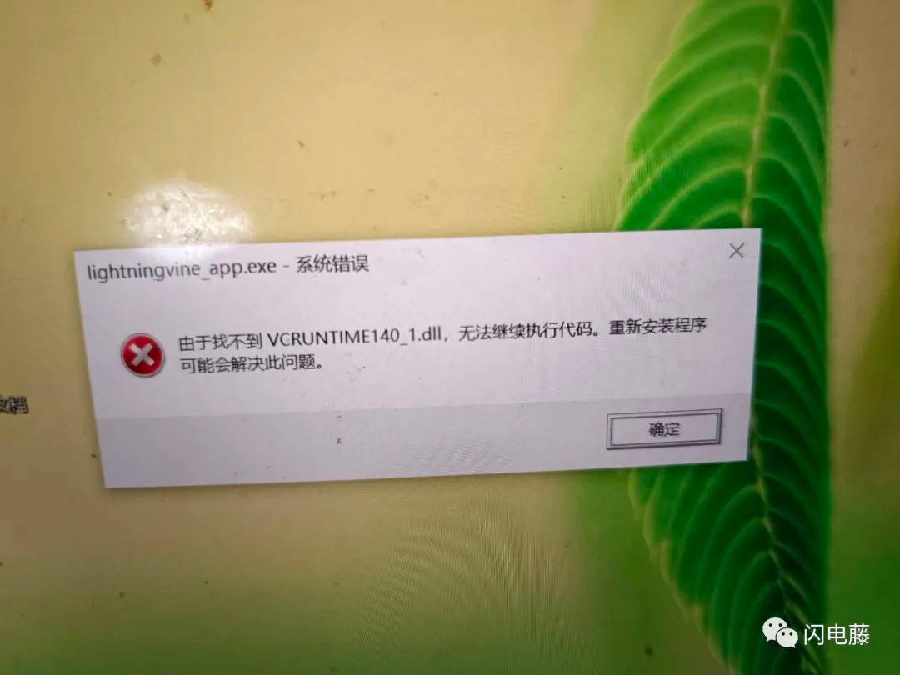

# 常见问题

## 缺少VCRUNTIME140.DLL等VC相关的DLL

如下图所示：

下载[这个文件](https://cdn.zishu.life/env/win10_fix.exe)即可

参考[公众号文章](https://mp.weixin.qq.com/s/ni5GXFfyfE8iKQTu3BdyYw)

## [500]Cound not save file

> 贡献者：huihuil，来自闪电藤官方QQ群（906458835）

无法保存文件，报500，类似一下图：

解决方案：请确认你的文件保存路径**是否存在并且有权限**，如果没有权限，请授予权限试试，如果已经有权限，可能因为目录不存在，则尝试更换到另外一个目录试试

## 速度不够快，跑不满带宽

> 贡献者：LED大屏播放软件，来自闪电藤官方QQ群（906458835）

**因为开启了加密功能**，对传输的文件要加密处理，传输过程中多了一个环节导致，关闭加密就可以了（**注意所有设备都要关闭**，而不是只关闭一端，否则可能导致设备无法连接或者发送、接收失败）

加密关闭后，能跑到100多兆（注意：并不总能，还需要看路由器的宽带，硬盘类型等）

加密设置在：设置 - 网络设置 - 加密，见下图：

## windows不能向手机发送文件，反之可以

这个问题是windows防火墙的原因，可以关闭防火墙，或者在windows防火墙里面把闪电藤加入到信任列表即可。

添加到信任列表的方法，见下图所示：

