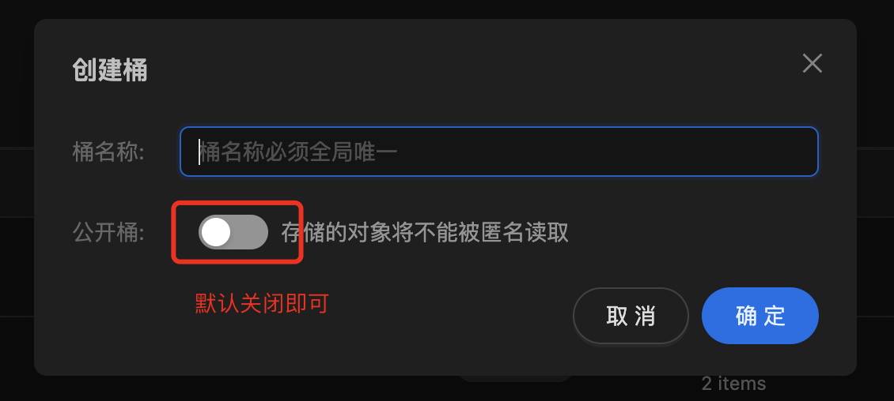

# 开始使用

## 1. 简介
闪电藤是基于LocalSend的二次开发产品，在原有局域网文件传输基础上，增加了webdav传输和云传输的能力，是一个万能的文件传输助手。

目前已支持了安卓、iOS、Mac、Windows和Linux，后续将会支持鸿蒙和web，web版后续的计划是能让大家通过一个固定url就可以传文件，这样不用安装闪电藤即可创文件。

闪电藤的目标是成为大家手边方便快捷的万能传输助手，逐步代替微信文件传输助手和快牙，我深知目前闪电藤还有很多缺陷，但请大家放心，我会竭力开发好闪电藤，不辜负大家的期望！

您可以关注我们的微信公众号，向我们反馈需求 or BUG

## 2. 下载
到[这里](/download)下载

## 3. 局域网
特点说明：
**闪电藤可以在同一个局域网下进行快速传输文件，不论是否在同一个WiFi或一个网段，只要能够互相访问即可**。局域网传输速度快，最高能达到100M/s，影响速度最大的原因是WiFi设置，在WiFi6下5gHz能达到最大速度。

使用注意事项：
- 要点1：通常来说，连接在同一个WiFi下的闪电藤，会自动发现彼此，自动连接
- 要点2：如果没互相发现的话，可以采用扫码进行连接，扫码功能在主页的右上角

收费政策：免费🆓

## 4. 云助手

云助手主要解决在**没有局域网环境下的传输问题**，速度通常在5~10M/s左右，主要取决于自身网络带宽，以及您所使用的服务提供商。

使用注意事项：仅仅是文字的话可以直接使用，但**文件传输需要配置云存储服务商**，只要是s3标准的服务商都可以接入，例如缤纷云、阿里云oss、腾讯云cos、亚马逊云、minio等。

收费政策：
- 文字传输免费🆓
- 文件传输仅限会员使用（没有一定的盈利，产品无法持久，希望能理解）

云存储服务推荐：
### 4.1 缤纷云
这里优先推荐使用[缤纷云](https://www.bitiful.com/)，它可以先使用后付费，而且价格相比腾讯阿里要便宜一倍，可以看这个[价格对比表](https://docs.bitiful.com/prices/compare)

### 4.1.1 建桶
先创建一个桶，为了安全性，建议使用私有桶。

#### 4.1.2 服务器地址 / 可用区
在桶信息下可以找到服务端点和服务可用区，如下图所示：

#### 4.1.3 Access Key / Secret Key
1. 先添加子账户，如下图所示：

2. 再给子账户授予权限，如下图所示：只需要读和写权限即可

3. 最后添加Key

#### 4.1.4 在闪电藤上设置

### 4.2 Minio私有云
#### 4.2.1 搭建私服
首先需要自己购买云服务器，然后在云服务器上搭建minio服务，具体参考[minio的官网](https://min.io/docs/minio/linux/index.html?ref=con)

#### 4.2.2 服务器地址
- Minio服务启动后，会打印API地址，如下图所示，这个API地址也对应闪电藤中的服务器地址

#### 4.2.3 可用区
闪电藤上不用填写

#### 4.2.4 Access Key和Secret Key

### 4.3 腾讯COS
服务器地址：`https://cos.{地区}.myqcloud.com`，比如您的存储在广州的话，地区可以用ap-guangzhou来代替，如：`https://cos.ap-guangzhou.myqcloud.com`，地区表建链接：[地域和可用区](https://cloud.tencent.com/document/product/213/6091)

要创建腾讯云访问秘钥，链接是：[API密钥管理](https://console.cloud.tencent.com/cam/capi)，创建好后，SecretId对应闪电藤的Access Key，另外一个对应Secret Key。

然后也是要建桶的，公开私有都可以，建议私有，其他请自行摸索。

### 4.4 阿里云OSS

和腾讯云类似，请自行摸索，后续再补充这块的文档。

---
文档更新时间：2024年10月13日 18:04